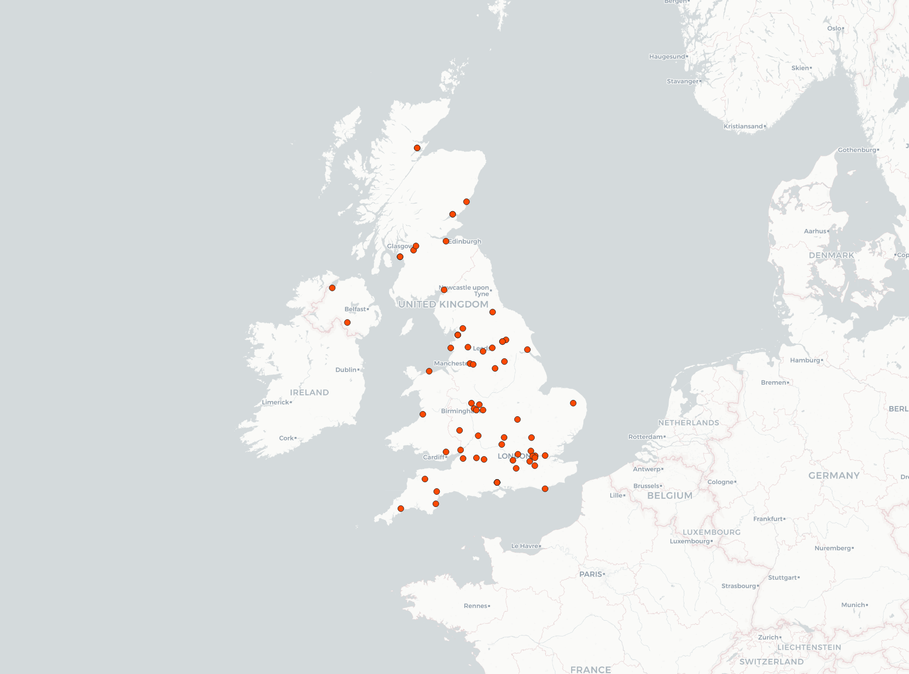
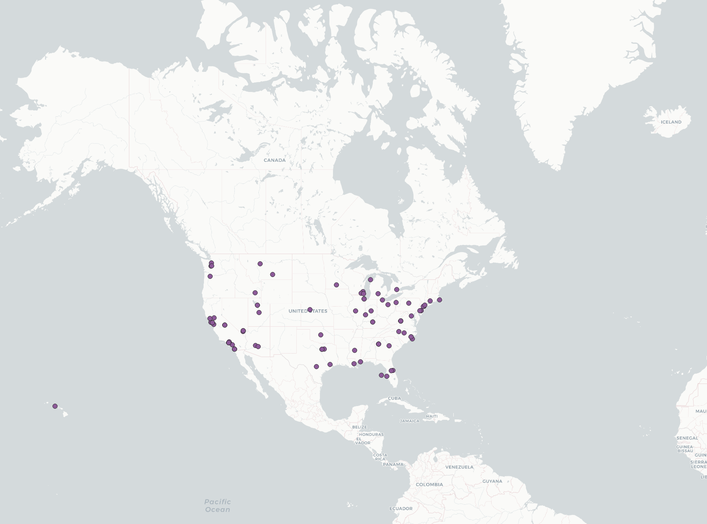
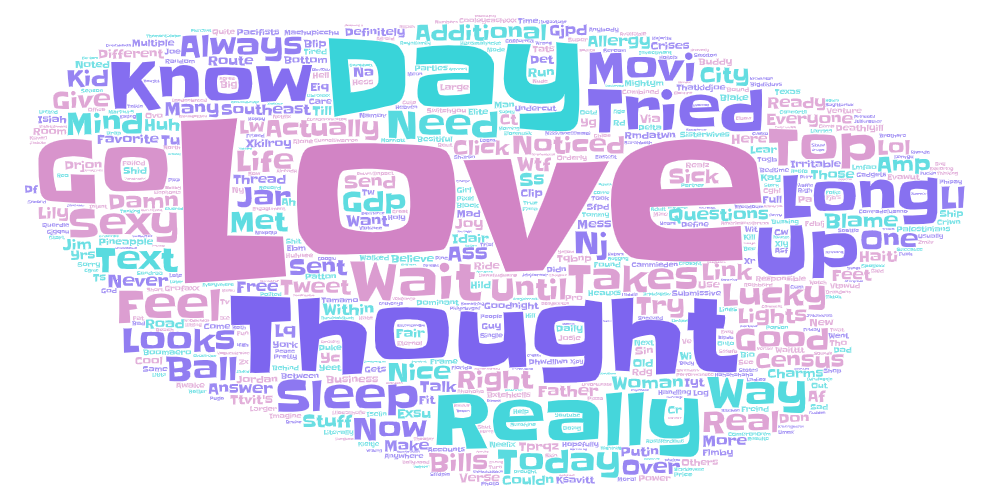
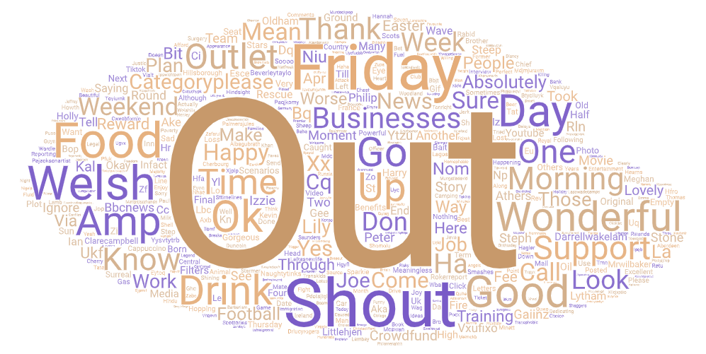

# geog458-lab2

## Introduce your comparison of two places or two time periods. Why do you want to make this comparison?

I choose to compare the United States and the United Kingdom to see how the two places compared when it comes to the Twittersphere. These two share a long history filled and I wanted to see how each use Twitter today.

---

## Export the two maps to the repository and then insert them to the readme.md. Please compare them and briefly discuss why they represent different geospatial patterns on the map.

The two maps show similar trends in geographic distribution of Tweets. In the US, we see a larger number of tweets located in the Eastern US. This can be explained by the fact that more cities (and naturally more people) are located there. In the UK, we can see more tweets from the central/southern area.

---

## Export the two word clouds to the repository and then insert them to the readme.md. Please compare them and briefly discuss why they represent different context.

The tweets were pulled 

